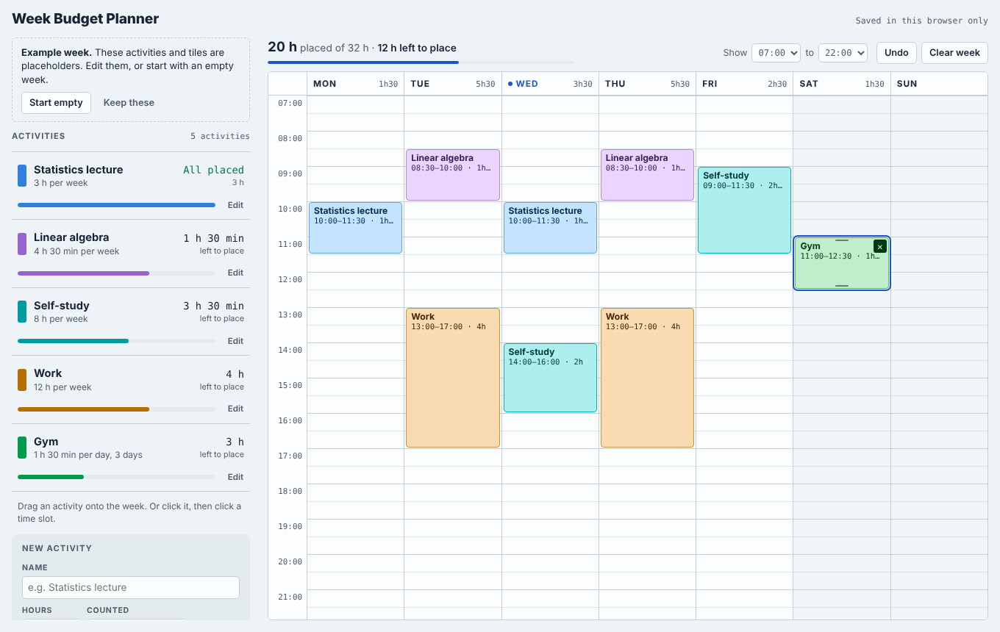

# Week Budget Planner

Give each activity (a class, a job, the gym) an hour budget per week or per day. Then put blocks of it on a Monday–Sunday week and resize them until every budget reads "All placed".

This repo starts as a handoff kit. The next step is building the app with SolidJS 2.0.

- `prototype/week-budget-planner.html`: the working prototype. Open it in a browser and it saves to localStorage.
- `docs/SPEC.md`: the behavior and design spec for the port, with the glossary.
- `docs/design/m3-tokens.css`: the Material 3 Expressive design tokens.
- `CLAUDE.md`: context for Claude Code sessions.
- `.claude/settings.json`: enables Google Chrome's [Modern Web Guidance](https://github.com/GoogleChrome/modern-web-guidance) plugin for Claude Code in this project.

